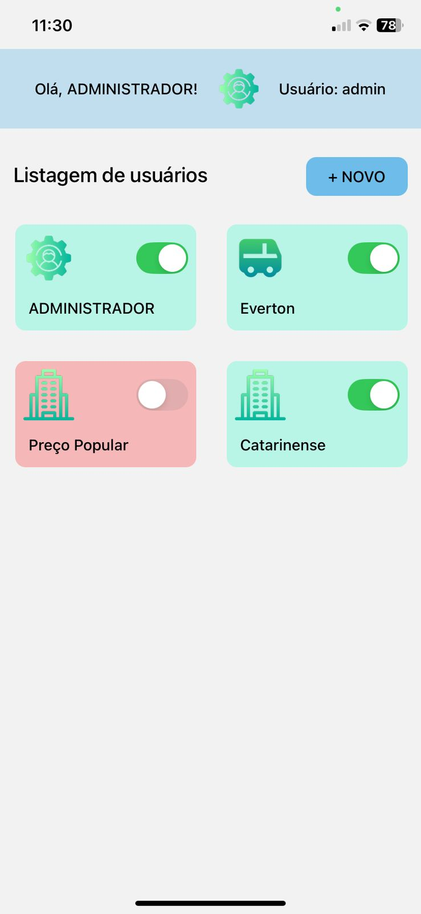

# PharmaFlow - README

## Índice
- [Introdução](#introducao)
- [Funcionalidades Principais](#funcionalidades-principais)
- [Tecnologias Utilizadas](#tecnologias-utilizadas)
- [Telas do Aplicativo](#telas-app)
- [Configuração e Execução do Projeto](#configuracao-e-execucao)
- [Melhorias Futuras](#melhorias-futuras)

## <a id="introducao"></a>1. Introdução

O Aplicativo PharmaFlow foi desenvolvido como objetivo de otimizar o controle de movimentações de produtos entre filiais, bem como a gestão de usuários (criação de usuários, ativar e inativar). 

##  <a id="funcionalidades-principais"></a>2. Funcionalidades Principais

-  Autenticação de usuários com diferentes perfis e permissões (Admin, Filial, Motorista)
-  Cadastro e transferência de produtos entre as filiais
-  Controle de estoque em tempo real por filial
-  Rastreamento completo das movimentações (Pendente/Em Progresso/Concluído)

## <a id="tecnologias-utilizadas"></a>3. Tecnologias Utilizadas

- **JavaScript (React Native)** — para a interface do usuário
- **TypeScript** — para garantir a tipagem e evitar erros
- **Lottie** — para ícones animados, melhorando a interatividade

### Bibliotecas Principais:

- `@react-native-async-storage/async-storage`
- `@react-native-picker/picker`
- `@react-navigation/native` e `@react-navigation/stack`
- `axios` — para requisições HTTP
- `expo` e `expo-image-picker` — para funcionalidades nativas do Expo
- `react-native-maps` — para visualização de mapas
- `react-native-picker-select` — para seleção de itens com visual personalizado
- `validator` — para validações de campos de entrada

## <a id="telas-app"></a>4. Telas do sistema

### Tela de Login


### Tela inicial no usuário de perfil Admin


### Tela de listagem de produtos


### Tela de listagem usuários


### Tela de criação de usuários


### Tela de listagem de movimentações - Filiais


### Tela de criação de movimentações - Filiais


### Tela de controle de movimentações - Motoristas


### Tela de mapa de trajeto entre as filiais


##  <a id="configuracao-e-execucao"></a>5. Configuração e Execução do Projeto

### Passo a passo:
1. Clone o servidor local: `template_m1` (link abaixo):
   ```bash
   git clone https://github.com/DEVinHouse-Clamed-V3/template_m1
   cd template_m1
   npm install
   npm run start
   ```

2. Clone este projeto (https://github.com/laisbecker/pharmaFlow), e configure o IP do servidor no arquivo .env do PharmaFlow:
   ```bash
   npm install
   cp .env-example .env
   npm run start
   ```
   
3. Baixe o EXPO em seu celular, e leia o QR code que vai aparecer no terminal do fron-end depois do comando npm run start.

4. Utilize o usuário abaixo para o Login inicial (perfil Admin:

   Email: admin@gmail.com,
   Senha: 123456

##  <a id="melhorias-futuras"></a>6. Melhorias futuras:

- Modo Escuro — para melhor conforto visual em ambientes com pouca luz.
- Localização em Tempo Real — para acompanhamento ao vivo das entregas.
- Notificações Push — para informar mudanças no status das movimentações em tempo real.
